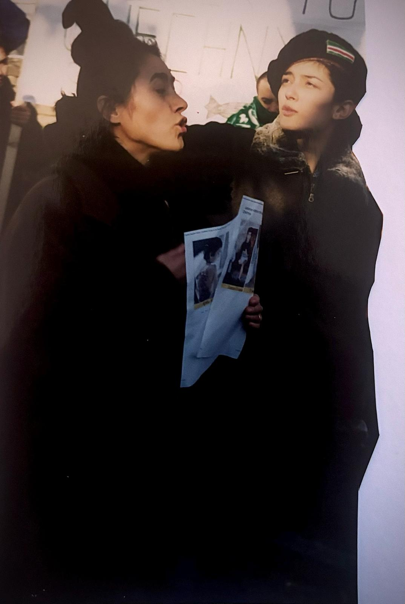
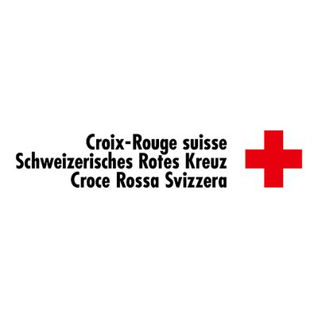

+++
title = "Das Leben nach dem Krieg"
date = "2024-03-14"
draft = false
pinned = false
tags = ["Krieg", "Leben", "Menschenbewegt", "Neustart", "Inspiration"]
image = "whatsapp-bild-2024-03-18-um-10.49.01_0526c8eb.jpg"
description = "Der Krieg bestehend aus dem Ersten und Zweiten Tschetschenienkrieg, war ein langanhaltender Konflikt in den 1990er und frühen 2000er Jahren in der Republik Tschetschenien, Russische Föderation. Ursprünglich durch nationalistische Bestrebungen der Tschetschenen nach Unabhängigkeit von Russland motiviert, führte der Zusammenbruch der Sowjetunion zu einer Eskalation. Dieser blutige Konflikt hatte weitreichende politische, soziale und wirtschaftliche Auswirkungen auf die Region und Russland insgesamt."
+++
# **Interview mit Madina Gechoi | Das Leben nach dem Krieg**

Durch das Projekt "Muristalden bewegt" ergab sich die Möglichkeit, ein tiefgründiges Interview mit Madina Gechoi zu führen. Madina ist eine bemerkenswerte Frau, die persönlich die Grausamkeiten des Krieges erlebt hat und nun ihre Erfahrungen teilt. Unser Gespräch konzentrierte sich auf das Leben nach dem Krieg, eine Zeit, die oft von Herausforderungen, aber auch von Hoffnung geprägt ist.

Dieses Interview wurde von Enziana Mezini gehalten, erstellt und veröffentlicht.

Enziana Mezini - Schülerin bei Muristalden Campus, 16 Jahre alt.

#### Der Tschetschenienkrieg

Der Krieg bestehend aus dem Ersten und Zweiten Tschetschenienkrieg, war ein langanhaltender Konflikt in den 1990er und frühen 2000er Jahren in der Republik Tschetschenien, Russische Föderation. Ursprünglich durch nationalistische Bestrebungen der Tschetschenen nach Unabhängigkeit von Russland motiviert, führte der Zusammenbruch der Sowjetunion zu einer Eskalation. Dieser blutige Konflikt hatte weitreichende politische, soziale und wirtschaftliche Auswirkungen auf die Region und Russland insgesamt.

Madina Gechoi ist eine Lehrerin, die den Tschetschenienkrieg hautnah erlebte. Im Interview gewährt sie Einblicke in ihre Erfahrungen während des Krieges und auf der Flucht.

* Name: Madina Gechoi
* Alter: 46 Jahre
* Beruf: Lehrerin
* Familiäre Situation: Kleine Familie

>  "Nach Oxford. London. Alles war bereit. Meiner Zukunft, meine Träume. Wie jeder Jugendliche, der auch hat. Plötzlich war alles auf einmal weg."

Madina Gechoi, 16 Jahre alt zum Zeitpunkt des Kriegsausbruchs im Dezember 1994, beschreibt den plötzlichen Beginn des Tschetschenienkriegs als eine drastische Veränderung ihres Lebens. Von einem gewöhnlichen Tag zum Chaos, von Hoffnungen und Träumen zur Angst um das eigene Überleben – der Krieg traf sie unvorbereitet.

Die Flucht vor der Gewalt war geprägt von ständiger Bewegung, Unsicherheit und der Suche nach einem sicheren Ort. Über drei Jahre hinweg kämpfte Madina Gechoi mit ihrer Familie darum, aus den Wirren des Krieges zu entkommen und ein neues Leben zu beginnen. Schließlich fanden sie Zuflucht in der Schweiz, wo sie auf die Hilfe des Roten Kreuzes zählen konnten.

#### Wie Sie ja schon wissen, werden wir heute darüber reden, was für eine Auswirkung der Krieg auf ihr Leben hatte oder auf die auf das Leben allgemein der Menschen. Und ich würde gerne gleich direkt hineintauchen und damit anfangen mit wie es ist, ein Krieg zu erleben. Sie haben den Tschetschenischen Krieg ja persönlich erlebt, könnten sie ein bisschen uns einen Input hierbei geben?

Ja, das war 1994. Es war ganz normal, alles funktionierte. Wir lebt dann auch so wie hier in der Schweiz. Freunde, verwandte, Familie. Wir hatten einen zuerst einen Putsch gehabt und dann nach diesem Putsch. Eineinhalb Monate später. Glaube ich. War es plötzlich. Im Fernsehen, so gegen 04:00 Uhr. Gab es Nachrichten und Fernseh war zu. Es war eine plötzliche Meldung. Nehmen sie schnell wie möglich nötig damit und verlassen sie ihren Haus.

#### Könnten Sie mir erklären, was Sie mit Putsch meinen?

Es gab Menschenpolitisch, also die bewegten und gegeneinander versuchten. Zu stürzen das politische Regierung die damalige politische Regierung. Und sie versucht dann, an die Macht zu kommen. Alliiert mit russischen Regierung. Und das war der Putsch.

#### Welcher ist ein Moment der Sie sehr geprägt hat im Krieg. Hat dies eine Auswirkungen auf ihr Leben heutzutage oder etwas haben sie etwas, dass Sie nicht loslassen können.

Ein Gefühl eben. Jemanden, den man sehr gerne hat oder jemanden aus der Familie. Zu verlieren. Das war eine, ja, das war Allerschlimmst. Plötzlich. Eigene Leute. Niemand verlor durch den Krieg. Angst. Angst ist auch leicht gesagt furchtbar. Dass eine Jugendliche oder um sein Leben kämpfen musste. Und diese Ziellosigkeit. Dass man nicht wusste, wird man überleben oder nicht. Hat eine Stärke. Ja, Nachfolge hinterlassen.

#### Wie alt waren sie, als der Krieg angefangen hat?

Ich war gerade 16 im Sommer. Als dann im Dezember am elften der Krieg anfing.

> Das Erste was ich gesehen habe, waren die Vögel, die Tauben, wie sie plötzlich auf der Straße lagen. Sie fielen runter als würde es regnen. Es war ein Chaos. Man verstand nicht, wo soll man hingehen?

#### wann war es, dass sie aus Tschetschenien geflohen sind?

Das war dann nach erst ein, eineinhalb Jahre später. Zuerst. Eben mussten wir flüchten und in verschiedene Länder und kurze Aufenthalte. Es war ständig Flucht.

#### Wie viele Länder haben sie denn angehalten, für diese Flucht in die Schweiz zu kommen? War es ein langer Prozess, weil sie haben. Eineinhalb haben sie gesagt, eineinhalb Jahren da gewartet, dass sie aus der Stadt fliehen konnten. Entschuldigung und. War dieser Prozess? Wie lange hat es gedauert und wie sind Sie dazu gekommen, in die Schweiz zu gehen?

Es war. Durch diese Ebene hin und her im Land, zuerst in der Hoffnung, dass es. Krieg zu Ende wird und dass wir wieder aufbauen können. Und dann im Nachhinein eben einmal waren wir in Pakistan. Wir versuchen jede 3 Monate. Eine Verlängerung für unsere. Pisse zu bekommen. Es gab sehr starke Kontrolle und man ließ uns nicht. Sozusagen atmen. Die Polizei kam ganze Zeit und sie schikanierten und wir mussten ihn mir in die in den Bewegung bleiben. Danach Versuch. Wieder erneut in Tschetschenien Fuß zu fassen. Zum zweiten Mal. Es ging nicht. Es gab eben Kriminelle, es gab Militärs, es war sehr gefährlich. Und dann war es definitiv die Zeit, wo man weiter ging. Man verbrachte wieder ein Jahr in diesem Land. Die Menschen waren sehr lieb dort. Es gab Hilfe um. Wir haben dann entschieden, durch den Roten Kreuz in die Schweiz. Zu fliehen, weil Gefahr war, zu groß in diesen Orten zu bleiben. Für Angehörige aus der Familie.

#### Könnte ich nochmal zu der Frage zurückkehren, wieviel ähm, wie lange hat dieser Prozess gedauert? Könnten Sie das schätzen?

Ja, das war gesamte Zeit, hatte 3 Jahre Zeit genommen, Gesamtmittel, Krieg zusammen.

#### Wie gehen Sie heute mit Traumata oder emotionalen Belastungen um, die sie die durch den Krieg entstanden sind?

Durch den Kontakt, der Kontakt mit der Familie.

> Wenn man transformiert. Durch eben die Behandlung. Dann kommt man am Ende eben zum Licht des Tunnels, sagt man es.

#### Also auch als wir gerade in die Schweiz kamen, gab es für sie direkt Unterstützung oder hat jemand probiert, sie aus dem Krieg zu holen?

Ja, aus dem Krieg zu holen gab es keine Hilfe. Man musste eben, man war auf sich selbst gestellt, aber. Sobald wir hier kamen, gab es eine professionelle Hilfe.

#### Eine Person oder eine spezifische Organisation, die sie besonders unterstützt hat?

Rote Kreuz, Internationale Rote Kreuz.

#### Haben Sie das für sich selber abgeschlossen?

Auf jeden Fall durch das Studium. Konnte ich für mich sehr vieles bearbeiten. 

#### Könnten Sie mir sagen, was Sie denn generell studiert haben oder wollen Sie das nicht?

Ja, sicher, ich habe Übersetzungen studiert und mich auf den Posttraumata spezialisiert, um meine Familie auch besser zu unterstützen und zu verstehen.

Madina Gechoi hat durch ihre Erfahrungen im Krieg und auf der Flucht tiefe Traumata erlebt, aber sie hat auch gelernt, damit umzugehen und sich langsam wieder aufzubauen. Ihre Geschichte ist eine Erinnerung an diejenigen, die unter Krieg leiden, aber auch an die Hoffnung auf ein besseres Morgen.

Dieses Interview mit Madina Gechoi verdeutlicht die Resilienz und den Überlebenswillen der Menschen, die von Konflikten betroffen sind. Ihre Stimme erhebt sich als Zeugnis für diejenigen, die durch den Krieg verloren wurden und für diejenigen, die noch kämpfen.

Ich bedanke mich Herzlich bei Madina Gechoi für ihre Zeit und Teilnahme. Frau Gechoi möchte nicht das ein Bild von ihr veröffentlicht wird mit ihrer Geschichte gemeinsam, anstadt hat sie mir zwei bilder geschickt, das erste ist wie sie mit Ihrer Mutter am Protestieren ist und das zweite ist vom Kaukasischem Gebierge. 

