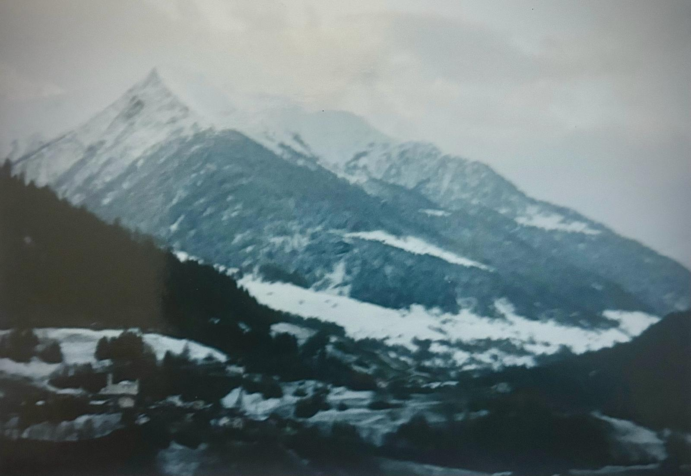

+++
title = "Das Leben nach dem Krieg"
date = "2024-03-14"
draft = false
pinned = false
tags = ["Krieg", "Leben", "Menschenbewegt", "Neustart", "Inspiration"]
image = "whatsapp-bild-2024-03-18-um-10.49.01_0526c8eb.jpg"
description = "Der Krieg bestehend aus dem Ersten und Zweiten Tschetschenienkrieg, war ein langanhaltender Konflikt in den 1990er und frühen 2000er Jahren in der Republik Tschetschenien, Russische Föderation. Ursprünglich durch nationalistische Bestrebungen der Tschetschenen nach Unabhängigkeit von Russland motiviert, führte der Zusammenbruch der Sowjetunion zu einer Eskalation. Dieser blutige Konflikt hatte weitreichende politische, soziale und wirtschaftliche Auswirkungen auf die Region und Russland insgesamt."
+++
# **Interview mit Madina Gechoi** 

Durch das Projekt "Muristalden bewegt" ergab sich die Möglichkeit, ein tiefgründiges Interview mit Madina Gechoi zu führen. Madina ist eine bemerkenswerte Frau, die persönlich die Grausamkeiten des Krieges erlebt hat und nun ihre Erfahrungen teilt. Das Gespräch konzentrierte sich auf das Leben nach dem Krieg, eine Zeit, die oft von Herausforderungen, aber auch von Hoffnung geprägt ist.

(Enziana Mezini - Schülerin bei Muristalden Campus, 16 Jahre alt.)



#### Der Tschetschenienkrieg

Der Krieg bestehend aus dem Ersten und Zweiten Tschetschenienkrieg, war ein langanhaltender Konflikt in den 1990er und frühen 2000er Jahren in der Republik Tschetschenien, Russische Föderation. Ursprünglich durch nationalistische Bestrebungen der Tschetschenen nach Unabhängigkeit von Russland motiviert, führte der Zusammenbruch der Sowjetunion zu einer Eskalation. Dieser blutige Konflikt hatte weitreichende politische, soziale und wirtschaftliche Auswirkungen auf die Region und Russland insgesamt.





Madina Gechoi ist eine Lehrerin, die den Tschetschenienkrieg hautnah erlebte. Im Interview gewährt sie Einblicke in ihre Erfahrungen während des Krieges und auf der Flucht.





Madina Gechoi ist 46 Jahre alt. Beruflich ist Sie als Lehrerin unterwegs. Sie ist Mutter von einer Tochter und ist seit bald 20 Jahren Verheiratet.



>  "Nach Oxford. London. Alles war bereit. Meine Zukunft, meine Träume. Plötzlich war alles auf einmal weg."

Madina Gechoi, 16 Jahre alt zum Zeitpunkt des Kriegsausbruchs im Dezember 1994, beschreibt den plötzlichen Beginn des Tschetschenienkriegs als eine drastische Veränderung ihres Lebens. Von einem gewöhnlichen Tag zum Chaos, von Hoffnungen und Träumen zur Angst um das eigene Überleben – der Krieg traf sie unvorbereitet.

Die Flucht vor der Gewalt war geprägt von ständiger Bewegung, Unsicherheit und der Suche nach einem sicheren Ort. Über drei Jahre hinweg kämpfte Madina Gechoi mit ihrer Familie darum, aus den Wirren des Krieges zu entkommen und ein neues Leben zu beginnen. Schließlich fanden sie Zuflucht in der Schweiz, wo sie auf die Hilfe des Roten Kreuzes zählen konnten.

#### **Wie ist es, ein Krieg zu erleben. Sie haben den Tschetschenischen Krieg persönlich erlebt, könnten Sie erzählen wie Sie alles aufgenommen haben und was Ihnen prägnant aus ihren Erinnerungen heraussticht?**

Das war 1994. Es war ganz normal, alles funktionierte. Wir lebten auch so wie hier in der Schweiz: Freunde, Verwandte, Familie. Wir hatten zuerst einen Putsch gehabt und dann nach diesem Putsch, eineinhalb Monate später, kam es plötzlich. Im Fernsehen, so gegen 04:00 Uhr, gab es Nachrichten und die Programme die im Fernsehen liefen wurden alle ausgestaltet. Es war eine plötzliche Meldung: "Nehmen sie schnell wie möglich nötig damit und verlassen sie ihren Haus."

#### Können Sie mir erklären, was Sie mit Putsch meinen?

Es gab Menschen, die politisch aktiv waren und gegeneinander arbeiteten, um die damalige Regierung zu stürzen. Sie versuchten, an die Macht zu kommen, indem sie sich mit der russischen Regierung verbündeten. Das war der Putsch.

#### Welcher Moment im Krieg hat Sie besonders geprägt? Hat dies Auswirkungen auf Ihr Leben heutzutage, oder gibt es etwas, das Sie nicht loslassen können?

Ein Gefühl, jemanden zu verlieren, den man sehr gerne hat oder jemanden aus der Familie. Das war das Allerschlimmste. Plötzlich. Eigene Leute. Niemand blieb vom Krieg verschont. Angst. Angst ist ein furchtbares Gefühl. Dass ein Jugendlicher um sein Leben kämpfen musste. Und diese Ziellosigkeit. Dass man nicht wusste, ob man überleben wird oder nicht. Das hat eine Stärke hinterlassen, ja.

#### Wie alt waren Sie, als der Krieg angefangen hat?

Ich war gerade 16 im Sommer geworden, als am elften Dezember der Krieg anfing.

> Das Erste, was ich gesehen habe, waren die Vögel, die Tauben, wie sie plötzlich auf der Straße lagen. Sie fielen runter, als würde es regnen. Es war ein Chaos. Man verstand nicht, wo man hingehen soll?

#### Wann war es, dass sie aus Tschetschenien geflohen sind?

Das war erst ein, eineinhalb Jahre später. Zuerst mussten wir flüchten und in verschiedene Länder reisen und blieben nur kurz an jedem Ort. Es war eine ständige Flucht.

Hier ist der korrigierte Text:

#### Wie viele Länder haben Sie durchquert, um in die Schweiz zu gelangen? War es ein langer Prozess? Sie haben gesagt, dass Sie eineinhalb Jahre gewartet haben, um aus der Stadt zu fliehen. Entschuldigung, wie lange hat dieser Prozess insgesamt gedauert und wie sind Sie letztlich in die Schweiz gekommen?

Es war ein ständiges Hin und Her im Land, zunächst in der Hoffnung, dass der Krieg zu Ende geht und wir wieder aufbauen können. Einmal waren wir in Pakistan. Wir mussten alle drei Monate versuchen, eine Verlängerung für unsere Papiere zu bekommen. Es gab sehr strenge Kontrollen, und man ließ uns kaum atmen. Die Polizei kam ständig und schikanierte uns, sodass wir ständig in Bewegung bleiben mussten. Danach versuchten wir erneut, in Tschetschenien Fuß zu fassen. Es ging nicht. Es gab Kriminelle, es gab Militärs, es war sehr gefährlich. Dann war es definitiv die Zeit, weiterzugehen. Wir verbrachten wieder ein Jahr in diesem Land. Die Menschen waren dort sehr lieb und es gab Hilfe. Schließlich entschieden wir uns, durch das Rote Kreuz in die Schweiz zu fliehen, weil die Gefahr in diesen Orten zu groß war, besonders für Angehörige der Familie.

#### Wie lange dieser Prozess insgesamt gedauert hat? Könnten Sie das schätzen?

Ja, der gesamte Prozess hat insgesamt drei Jahre gedauert, zusammen mit dem Krieg.

#### Wie gehen Sie heute mit den Traumata oder emotionalen Belastungen um, die durch den Krieg entstanden sind?

Durch den Kontakt mit der Familie.

> Am ende vom jedem Tunnel ist das Licht.

#### Als Sie in die Schweiz kamen, gab es da sofort Unterstützung, oder hat jemand versucht, Sie aus dem Krieg zu holen?

Ja, aus dem Krieg zu holen gab es keine Hilfe. Man war auf sich selbst gestellt. Aber sobald wir hier waren, gab es professionelle Hilfe.

#### Gab es eine Person oder eine spezifische Organisation, die Sie besonders unterstützt hat?

Das Internationale Rote Kreuz.

#### Haben Sie das für sich selber abgeschlossen?

Auf jeden Fall, durch das Studium konnte ich sehr vieles für mich verarbeiten.

#### Was haben Sie Studiert?

Madina Gechoi hat Übersetzung studiert und sich auf Posttraumata Spezialisiet, um Ihre Familie zu unterstützen und verstehen.

Madina Gechoi hat durch ihre Erfahrungen im Krieg und auf der Flucht tiefe Traumata erlebt, aber sie hat auch gelernt, damit umzugehen und sich langsam wieder aufzubauen. Ihre Geschichte ist eine Erinnerung an diejenigen, die unter Krieg leiden, aber auch an die Hoffnung auf ein besseres Morgen.

Dieses Interview mit Madina Gechoi verdeutlicht die Resilienz und den Überlebenswillen der Menschen, die von Konflikten betroffen sind. Ihre Stimme erhebt sich als Zeugnis für diejenigen, die durch den Krieg verloren wurden und für diejenigen, die noch kämpfen.

Frau Gechoi möchte nicht dass ein Bild von ihr veröffentlicht wird stattdessen hat Sie zwei Bilder zugeschickt: Das erste ist, wie Sie mit Ihrer Mutter am Protestieren ist, und das zweite ist vom Kaukasischen Gebirge. 

