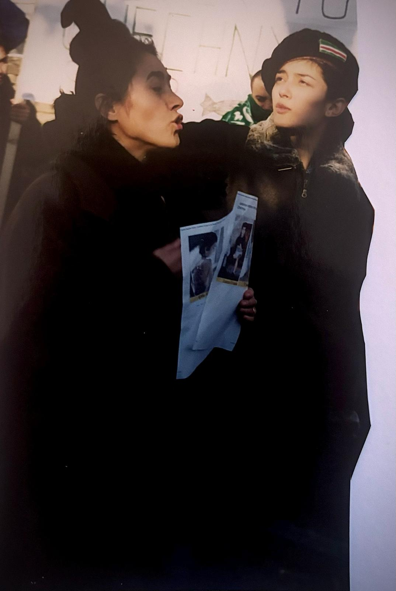
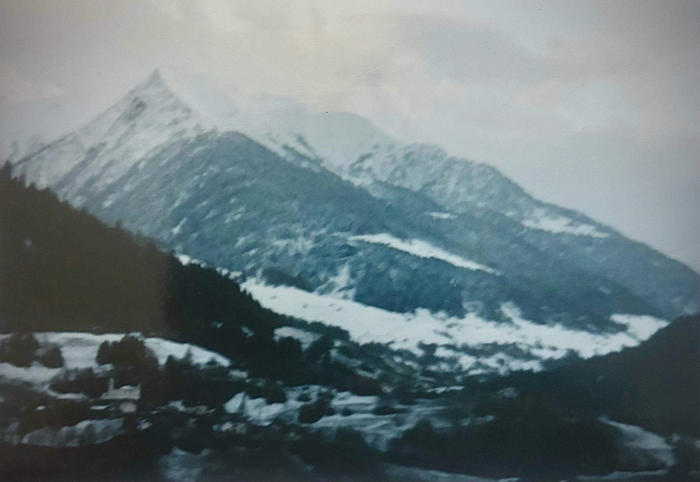

+++
title = "Kriegserfahrungen und Neuanfang: Madina Gechois Geschichte"
date = "2024-06-08"
draft = false
pinned = true
tags = ["Kriegserfahrungen", "Tschetschenien", "Überlebensgeschichte", "Stärke", "Kriegsflüchtlinge", "Erfolgsgeschichte"]
image = "whatsapp-bild-2024-03-18-um-10.50.40_0feccc7e.jpg"
description = "Das Leben nach dem Krieg bedeutet für viele Menschen immense Herausforderungen, aber auch die Hoffnung auf einen Neuanfang. Erfahren Sie in dieser fesselnden Reportage, wie Madina Gechoi den Tschetschenischen Krieg erlebte und ihr Leben danach gestaltete."
+++
**Erfahrungen im Krieg**

*von Enziana Mezini*

Das Leben von Madina Gechoi ändert sich schlagartig im Jahr 1994. Damals ist sie erst 16 Jahre alt und lebt mit ihrer Familie in der Republik Tschetschenien. Was als gewöhnlicher Tag beginnt, verwandelt sich in ein Drama, als im Fernsehen plötzlich eine beunruhigende Meldung ausgestrahlt wird: Alle Bewohner sollen ihre Häuser so schnell wie möglich verlassen. Für Madina und ihre Familie markiert dies den Beginn eines schmerzhaften Kapitels in ihrem Leben.

**Flucht und Unsicherheit**

"Wir sind ständig in Bewegung", erinnert sich Madina. "Es gibt Momente, in denen wir uns nirgendwo sicher fühlen." Ihre Reise führt sie und ihre Familie durch verschiedene Länder, darunter Pakistan, wo sie vorübergehend Schutz finden. Die Flucht ist geprägt von Unsicherheit und Angst, und die Familie muss ständig ihren Aufenthaltsort wechseln, um Verfolgung und Gewalt zu entgehen.

Die Ungewissheit, wie es weitergehen wird, ist eine der größten Herausforderungen für Madina und ihre Familie. Sie verbringen insgesamt drei Jahre auf der Flucht, bevor sie schließlich eine sichere Zuflucht in der Schweiz finden. 

> "Es ist eine Zeit der ständigen Anspannung und des Verlusts."

Trotz der Schwierigkeiten findet Madina Unterstützung bei ihrer Familie und den Menschen, die ihnen auf ihrer Reise begegnen. Diese Solidarität hilft ihr, die schweren Zeiten zu überstehen und neue Hoffnung zu schöpfen.

Heute blickt Madina auf diese Zeit mit einer Mischung aus Dankbarkeit und Schmerz zurück. Dankbar dafür, dass sie schließlich Sicherheit gefunden hat, und schmerzhaft über die Erfahrungen, die sie und ihre Familie während der Flucht gemacht haben. Ihre Geschichte ist ein Zeugnis der Widerstandsfähigkeit und Stärke, die Menschen in Zeiten der Unsicherheit zeigen können.



**Hintergrundwissen: Tschetschenienkonflikt**

* **Beginn**: Der erste Tschetschenienkrieg beginnt 1994, als Russland versucht, die abtrünnige Region Tschetschenien wieder unter seine Kontrolle zu bringen.
* **Folgen**: Der Krieg führt zu massiver Zerstörung und Vertreibung der Zivilbevölkerung.
* **Flucht**: Viele Tschetschenen fliehen in Nachbarländer oder nach Europa, um dem Krieg zu entkommen.



**Herausforderungen und Unterstützung**

Die Flucht aus Tschetschenien stellt Madina Gechoi und ihre Familie vor zahlreiche Herausforderungen. "Es ist ein ständiger Kampf ums Überleben", erinnert sich Madina. Die Familie ist auf sich allein gestellt, ohne Gewissheit über ihre Zukunft und ohne Möglichkeit, sich auf Unterstützung von außen zu verlassen.

Madina beschreibt die Härten, die sie und ihre Familie während ihrer Reise durch verschiedene Länder erleben. Die Unsicherheit, nicht zu wissen, wohin als Nächstes, und die Angst vor Verfolgung sind allgegenwärtig. "Wir wissen nie, wann die nächste Gefahr auf uns zukommt", sagt Madina.

Trotz fehlender Unterstützung während des Krieges findet Madina Halt und Trost bei ihrer Familie. "Unsere Familie ist unsere Stärke", betont sie. Die Bindung zueinander hilft ihnen, die schwierigsten Zeiten zu überstehen und weiterzukämpfen.

Nach der Flucht in die Schweiz erhält Madina endlich professionelle Hilfe, die ihr hilft, ihre traumatischen Erfahrungen zu verarbeiten. "Die Unterstützung von Ärzten und Therapeuten ist entscheidend für meine Genesung", erklärt sie. Dank dieser Hilfe kann Madina lernen, mit den Folgen des Krieges umzugehen und ihren Lebensweg neu zu gestalten.

Madinas Geschichte zeigt, wie wichtig ein starkes Unterstützungsnetzwerk ist, um Krisen zu bewältigen. Ihre Familie war ihr Fels in der Brandung, und die professionelle Hilfe gab ihr die Werkzeuge, um die psychischen Wunden des Krieges zu heilen.

 

**Heilung und Verarbeitung**

Madina entscheidet sich, Übersetzungen zu studieren und sich auf Posttraumata zu spezialisieren. "Das Studium hilft mir, die Komplexität meiner Erfahrungen zu verstehen und einen Beitrag zur Unterstützung anderer zu leisten", erklärt sie. Durch ihr Studium kann sie nicht nur sich selbst besser verstehen, sondern auch ihrer Familie helfen, die Folgen des Krieges zu bewältigen.

Die Arbeit an ihrer eigenen Heilung und das Wissen, dass sie anderen helfen kann, gibt Madina Kraft. Ihr Fachwissen ermöglicht es ihr, ihre Familie und andere Menschen, die Ähnliches erlebt haben, besser zu unterstützen.

> "Es ist ein Weg, den Schmerz in etwas Positives zu verwandel."

**Neue Perspektiven**

Für Madina Gechoi war die Zeit nach dem Krieg eine Gelegenheit, ihr Leben neu zu gestalten und eine positive Zukunft aufzubauen. "Meine Familie war meine größte Unterstützung und hat mir geholfen, meinen Weg zu finden", erzählt sie. Ihre Familie gab ihr die Stärke, die sie brauchte, um die traumatischen Erfahrungen des Krieges zu verarbeiten und sich auf eine bessere Zukunft zu konzentrieren.

Madina spricht von ihrem Weg zum "Licht am Ende des Tunnels" als einem Prozess der Selbstheilung und Transformation. "Es war nicht einfach, die Dunkelheit zu überwinden", sagt sie, "aber ich habe gelernt, meine Erfahrungen in etwas Positives zu verwandeln." Ihr Studium und ihre Arbeit als Lehrerin geben ihr die Möglichkeit, anderen zu helfen und ihre eigenen Träume zu verwirklichen.

Die Hoffnung auf eine bessere Zukunft treibt Madina an. Sie hat sich zum Ziel gesetzt, das Leben anderer positiv zu beeinflussen und Menschen zu unterstützen, die ähnliche Erfahrungen gemacht haben. "Ich möchte anderen zeigen, dass es immer einen Weg gibt, selbst in den schwierigsten Zeiten", sagt sie.

Madina hat in ihrem Leben extreme Herausforderungen durch Krieg und Flucht erlebt, aber auch ihre bemerkenswerte Widerstandsfähigkeit und Hoffnung bewiesen. Meine Recherche hat gezeigt, dass viele Flüchtlinge ähnliche psychische Belastungen wie Madina, wie zum Beispiel PTBS ( Posttraumatische Belastungsstörung), durchleben. Es ist entscheidend, therapeutische Unterstützung und ein stabiles Umfeld für ihre Genesung zu erhalten. Studien belegen, dass Bildung und berufliche Qualifikationen, wie Madinas Studium der Übersetzungen, die Integration und das Wohlbefinden von Flüchtlingen erheblich verbessern.

Madinas Geschichte ist ein beeindruckendes Beispiel für Widerstandsfähigkeit und Hoffnung. Obwohl ihre Familie die Schwierigkeiten der Flucht erlebt hat, haben sie in der Schweiz Sicherheit und Unterstützung gefunden. Durch ihr Studium kann Madina ihre eigenen Erfahrungen besser verstehen und anderen helfen. Ihre Geschichte zeigt, dass trotz großer Herausforderungen eine positive Zukunft möglich ist. Madina verkörpert die Stärke und Entschlossenheit, die notwendig sind, um nach Krieg und Flucht wieder aufzubauen und zu heilen.

**Über die Autorin:**

Enziana Mezini, 16 Jahre alt, Schülerin am Gymnasium Muristalden. Diese Reportage ist Teil eines Deutschprojekts, aber für mich bedeutet sie viel mehr. Während Madina mit 16 Jahren ein Leben voller Unsicherheit und Flucht erlebte, lebe ich in Sicherheit, habe meine Familie an meiner Seite und muss mir nie Sorgen um die nahe Zukunft machen. Madinas Geschichte hat meine Lebensperspektive verändert und mich inspiriert, und ich hoffe, dass sie auch Sie inspiriert.